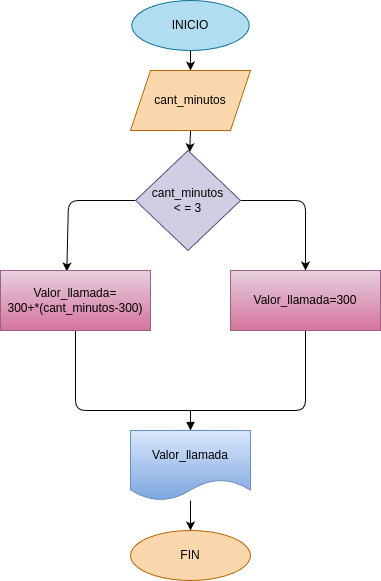

# Condicionales_1
Condicionales número 1

## Costo de una llamada telefónica

Ingresar el tiempo de duración de una llamada telefónica y determinar la cantidad pagar, de acuerdo con lo siguiente: 
- Toda llamada que dure un minuto o menos tiene un costo de 300 pesos. 
- Cada minuto adicional cuesta 50 pesos.u

## input 

### Variabales de entrada
cant_minutos: cantidad de minutos que duro la llamada
### Processing 
valor_llamada: calcular el valor final de la llamada

si es menor o igual a 3 minutos: el valor final sera de 300 pesos 
si es mayor a 3 minutos : 300+50*(cant_minutos-3)

### output
valor_llamada

# Diseño

# construcción

